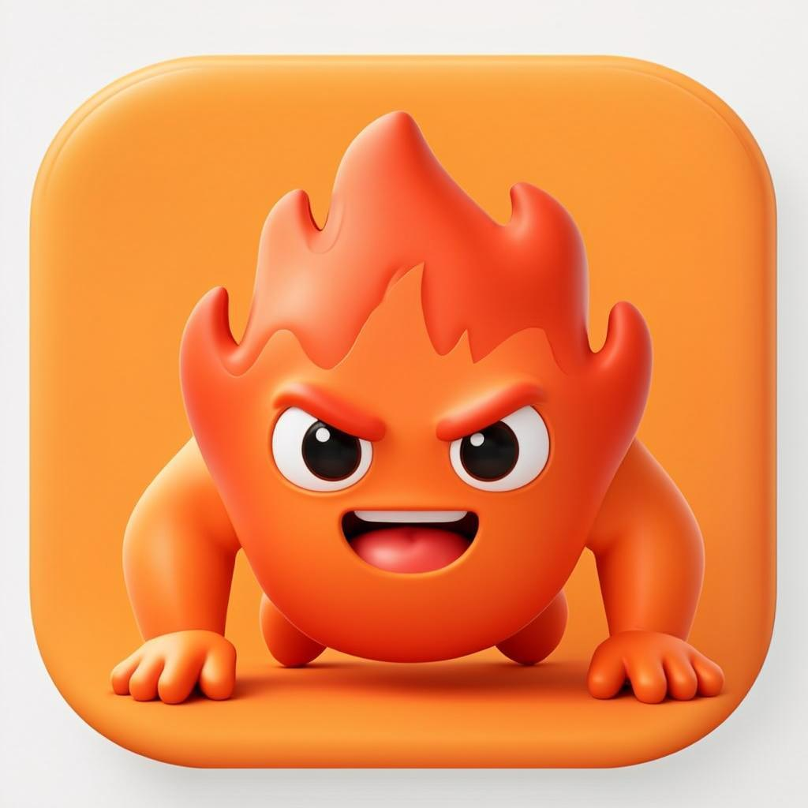

<div dir="rtl" align="center">



# 🔥 پوش‌آپ چلنج

**چالش ۳۰ روزه شنا سوئدی — به سبک دولینگو!**

اپ موبایل فارسی (RTL) با برنامه علمی ۳۰ روزه، استریک روزانه، XP و سطح‌بندی، ۱۴ نشان دستاورد، جشن کاغذرنگی و یادآوری روزانه با نوتیفیکیشن و صدا.

</div>

---

## ✨ امکانات

- 📅 **برنامه ۳۰ روزه بر پایه تحقیق** — شروع با ۵ شنا، پیش‌بار تدریجی ~۱۰-۱۵٪ در هفته، ریکاوری هر ۷ روز، ست‌بندی با استراحت ۶۰-۹۰ ثانیه (الگوی EverydayHealth Challenge + Hundred Push Ups + NSCA/NASM)
- 🔥 **استریک دولینگویی** — هر روز تقویمی (Asia/Tehran) که چک‌این کنی استریکت +۱
- 🏆 **گیمیفیکیشن کامل** — XP از مجموع شناهها، ۸ سطح (تازه‌کار تا افسانه)، ۱۴ نشان
- 🔔 **یادآوری روزانه با صدا** — نوتیفیکیشن بومی اندروید (حتی وقتی اپ بسته است) / Web Push در مرورگر
- 📶 **کاملاً آفلاین (APK)** — داده‌ها در localStorage گوشی، بدون نیاز به سرور
- 🎊 **جشن کاغذرنگی**، تایمر استراحت بین ست‌ها، راهنمای فرم صحیح (NASM)، هپتیک ویبره، اشتراک‌گذاری
- 🌗 تم روشن/تاریک، فونت وزیرمتن، تقویم شمسی
- ⚙️ تنظیمات: تم، یادآوری (ساعت دلخواه)، ریست کامل چالش

## 📲 نصب APK اندروید

آخرین APK را از بخش [Releases](https://github.com/KourosHiiii/pushup-challenge/releases) دانلود و نصب کن (اجازه «نصب از منابع ناشناس» را بده).

APK با هر push به main به‌صورت خودکار با GitHub Actions ساخته می‌شود (`.github/workflows/build-apk.yml`).

## 🛠 تکنولوژی

Next.js 16 (App Router) · TypeScript · Tailwind CSS 4 · shadcn/ui · Prisma + SQLite (نسخه وب) · Capacitor 8 (APK) · framer-motion · recharts · Web Push + @capacitor/local-notifications

## 🚀 اجرا (نسخه وب)

```bash
bun install
cp .env.example .env   # کلیدهای VAPID را با `npx web-push generate-vapid-keys` بساز
bun run db:push
bun run dev
```

> نسخه وب از API + دیتابیس استفاده می‌کند؛ نسخه APK کاملاً آفلاین است.

<div dir="rtl">

*این برنامه جایگزین مشاوره پزشکی نیست.*

</div>
